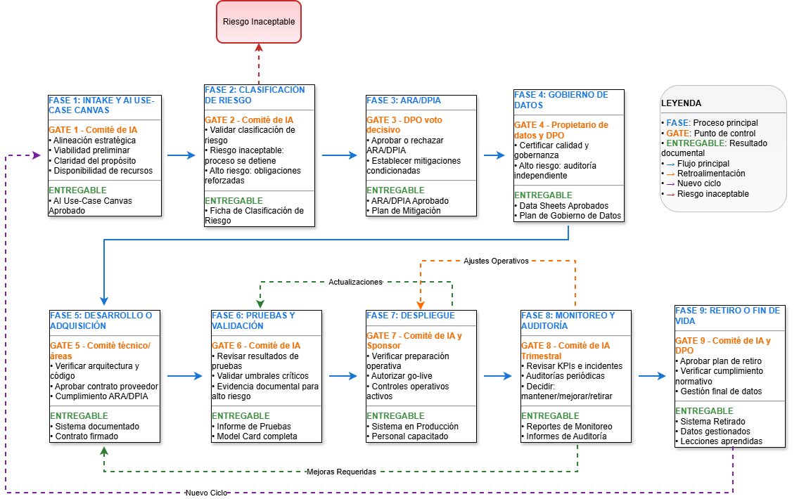

# Capa 3: Flujo de Gobernanza de IA

### [Ir a Link: Ciclo de vida IA](https://javier-rocha.github.io/framework-ia-distrito.github.io/4.1.3%20Ciclo%20de%20vida%20IA.html)

Nueve etapas sucesivas para garantizar una adopción responsable y estructurada de sistemas de IA.

## Fase 1 - Intake y AI Use-Case Canvas
**Descripción:** Se formaliza la idea del caso de uso mediante el AI Use-Case Canvas.
- **Actividades:**
  - Completar AI Use-Case Canvas.
  - Valoración de viabilidad.
  - Identificación de riesgos y partes interesadas.
- **Gate de Revisión G1 - Comité de IA:** El Comité de IA evalúa la alineación estratégica, viabilidad y propósito.
- **Entregable:** AI Use-Case Canvas aprobado.
- **Herramientas:** [IA Use-Case Canvas](4.2.1%20IA%20Use-Case%20Canvas.md)

Guía de Implementación: Fase 1 - Intake y AI Use-Case Canvas
Esta fase es el punto de partida formal para cualquier iniciativa de IA. Es liderada por el área de negocio o usuaria que identifica una oportunidad o necesidad.

Actividades Clave y sus Referencias en el Framework
1. Diligenciamiento del AI Use-Case Canvas
Descripción de la Actividad: El Sponsor de Negocio (el líder del área usuaria) es el responsable de liderar la creación de la propuesta. Utilizando la plantilla del AI Use-Case Canvas, debe documentar de manera clara y concisa las 12 secciones que componen la herramienta. Esto incluye:

El problema a resolver y los objetivos que se persiguen.
Los actores involucrados (usuarios, ciudadanos afectados).
Los datos que se necesitarían, haciendo una mención inicial si son personales o sensibles.
Los riesgos preliminares y las métricas de éxito esperadas.
Una primera estimación del plan de despliegue y monitoreo.
Referencias clave (Capítulo 4.1 y 4.2):

Caja de Herramientas (Sección 4.2.1): Esta actividad es la aplicación directa del instrumento "AI Use-Case Canvas". El diligenciamiento de la plantilla obliga al proponente a pensar en todas las dimensiones de la gobernanza desde el primer momento.
Modelo de Gobierno (Sección 4.1.2.2): Es la primera gran responsabilidad del rol de "Sponsor de Negocio (Product Owner)", que es quien impulsa la iniciativa.
Principios Fundamentales (Sección 4.1.1): El canvas fuerza a una reflexión temprana sobre todos los principios. Por ejemplo, la sección de "Datos Requeridos" activa el principio de "Privacidad por diseño", y la sección de "Identificación Preliminar de Riesgos" obliga a considerar la "Equidad y no discriminación" desde la concepción.
2. Valoración Preliminar Multidisciplinaria
Descripción de la Actividad: Una vez que el Sponsor de Negocio tiene un borrador del canvas, este no avanza en solitario. Se comparte con un grupo de roles clave para una primera evaluación o "filtro de viabilidad":

El Responsable Técnico evalúa si la idea es técnicamente factible con la tecnología y los datos disponibles o alcanzables.
El Delegado de Protección de Datos (DPO) realiza una valoración inicial de los riesgos de privacidad.
El Área Jurídica y de Planeación revisan la conformidad legal preliminar y la viabilidad presupuestal.
Referencias clave (Capítulo 4.1):

Modelo de Gobierno (Sección 4.1.2): Esta actividad representa la primera interacción entre los roles clave definidos en el modelo: Sponsor de Negocio, Responsable Técnico y miembros del Comité de IA como el DPO y los representantes de Jurídica y Planeación.
Matriz RACI (Sección 4.1.2.3): La matriz para la fase "Intake y Canvas" se materializa aquí. El Sponsor es "Accountable" (A), el Responsable Técnico es "Responsible" (R) de su parte, y el Comité y Jurídica son "Consulted" (C).
Políticas Fundamentales (Sección 4.1.1): La participación del DPO pone en marcha la "Política de Gobierno de Datos" (4.1.1.1), mientras que la identificación de riesgos activa la "Política de Gestión de Riesgos de IA" (4.1.1.2).
Punto de Control (Gate 1): Revisión y Decisión del Comité de IA
Descripción: El Comité de IA se reúne para revisar el AI Use-Case Canvas ya enriquecido con la valoración preliminar. Esta es la primera decisión formal de gobernanza del ciclo de vida.
Decisión: El Comité evalúa la propuesta contra cuatro criterios clave:
Alineación Estratégica: ¿Responde el caso de uso a los objetivos de la entidad?
Viabilidad Preliminar: ¿Es técnica, legal y presupuestalmente realista?
Claridad del Propósito: ¿Está bien definido el problema y el valor que se espera generar?
Disponibilidad de Recursos: ¿Existen los recursos o un plan para obtenerlos? Basado en esto, el Comité decide si aprueba el paso a la Fase 2 (Clasificación de Riesgo), lo rechaza, o lo devuelve para que se aclare o complete la información.
Referencia en el Framework (Capítulo 4.1):
Modelo de Gobierno (Sección 4.1.2.1): Este es el primer acto de supervisión del Comité de IA, que actúa como el guardián estratégico del portafolio de proyectos de IA.
Métricas y KPIs (Sección 4.1.5): La sección "Métricas de Éxito" del canvas es revisada por el comité para asegurar que el proyecto busca generar un valor público medible y está alineado con las métricas de impacto institucional.

## Fase 2 - Clasificación de Riesgo
**Descripción:** Se asigna un nivel de riesgo (inaceptable, alto, limitado o mínimo).
- **Actividades:**
  - Evaluación de matriz de clasificación.
  - Asignación de nivel de riesgo.
  - Activación de obligaciones reforzadas para alto riesgo.
- **Gate de Revisión G2 - Comité de IA:** El Comité de IA revisa y valida la clasificación.
- **Entregable:** Ficha de Clasificación de Riesgo.
- **Herramientas:** [Matriz de Riesgo](4.2.2%20Matriz%20de%20Riesgo.md)

Guía de Implementación: Fase 2 - Clasificación de Riesgo
Esta fase se activa una vez que el AI Use-Case Canvas ha sido aprobado en el Gate 1. Es una fase corta pero de máximo impacto estratégico.

Actividades Clave y sus Referencias en el Framework
1. Aplicación de la Taxonomía de Riesgo
Descripción de la Actividad: El equipo del proyecto, liderado por el Sponsor de Negocio y el Responsable Técnico, evalúa el caso de uso contra los criterios definidos en la política de riesgos. Se debe analizar:

Propósito del sistema: ¿Para qué se usará? (ej. evaluar acceso a un servicio, optimizar una ruta).
Población afectada y tipo de decisión: ¿Afecta derechos fundamentales o el acceso a servicios esenciales?
Datos procesados: ¿Utiliza datos sensibles o biométricos?
Consecuencias de errores: ¿Cuál es el impacto potencial de un fallo? Basado en este análisis, el sistema se clasifica en una de las cuatro categorías: Inaceptable, Alto, Limitado o Mínimo.
Referencias clave (Capítulo 4.1):

Política de Gestión de Riesgos de IA (Sección 4.1.1.2): Esta actividad es la aplicación directa del "Sistema de clasificación de riesgos" descrito en dicha política. Las definiciones de cada nivel de riesgo (ej. qué se considera "inaceptable" o "alto riesgo") provienen de esta sección.
Principios Fundamentales (Sección 4.1.1): La clasificación es la primera materialización concreta de los principios. Un sistema que viole el "Respeto por los derechos humanos" se clasificará como Inaceptable. Uno que afecte la "Equidad" en el acceso a programas sociales será de Alto Riesgo. Un chatbot que solo requiera ser transparente sobre su naturaleza será de Riesgo Limitado, cumpliendo el principio de "Transparencia".
2. Determinación de las Obligaciones de Gobernanza
Descripción de la Actividad: La clasificación tiene consecuencias directas e inmediatas:

Si es Riesgo Inaceptable: El proceso se detiene por completo y el proyecto se cancela. No puede avanzar bajo ninguna circunstancia.
Si es Alto Riesgo: Se activan las "obligaciones reforzadas". Esto significa que el proyecto deberá cumplir con los requisitos más estrictos en las fases siguientes:el ARA/DPIA de la Fase 3 se vuelve obligatorio, se exigirá documentación técnica exhaustiva en la Fase 5, las pruebas de la Fase 6 serán más rigurosas y las auditorías de la Fase 8 deberán ser más frecuentes e incluir una evaluación externa.
Si es Riesgo Limitado o Mínimo: El camino es más ágil. La Fase 3 (ARA/DPIA) puede no ser necesaria (a menos que se traten datos sensibles), y los requisitos de documentación y auditoría son menos intensivos.
Referencias clave (Capítulo 4.1):

Ciclo de Vida (Sección 4.1.3): La clasificación en esta fase es un "interruptor" que modifica el flujo del ciclo de vida. Determina si la Fase 3 (ARA/DPIA) es obligatoria o no.
Controles Clave (Sección 4.1.4): La profundidad con la que se implementarán y auditarán los controles de "Supervisión humana significativa" (4.1.4.1), "Documentación técnica" (4.1.4.4) y otros, es proporcional al nivel de riesgo asignado aquí.
Punto de Control (Gate 2): Validación de la Clasificación
Descripción: El Comité de IA revisa la clasificación propuesta por el equipo y la justificación que la sustenta. No es una simple formalidad; el Comité debe estar convencido de que la clasificación es correcta, ya que esto tiene implicaciones significativas en los recursos y el tiempo que consumirá el proyecto.
Decisión: El Comité valida formalmente la clasificación. Esta decisión se documenta en la Ficha de Clasificación de Riesgo.
Referencia en el Framework (Capítulo 4.1):
Modelo de Gobierno (Sección 4.1.2): La Matriz RACI (4.1.2.3) establece que el Comité de IA (4.1.2.1) es "Accountable" (A) de esta decisión. Es una de sus responsabilidades más importantes.
Instrumentos Operativos (Sección 4.1.2.4): El resultado de esta fase (el nivel de riesgo) se convierte en un campo clave y obligatorio en el "Registro Central de Casos de Uso de IA", permitiendo tener una visión global del portafolio de riesgos de IA de la entidad.

## Fase 3 - ARA/DPIA (alto riesgo o datos sensibles)
**Descripción:** Identificar y mitigar impactos sobre derechos fundamentales y la privacidad.
- **Actividades:**
  - Completar Plantilla ARA/DPIA.
  - Análisis de riesgos.
  - Propuestas de medidas de mitigación.
- **Gate de Revisión G3 - DPO:** El DPO aprueba o rechaza el documento.
- **Entregable:** ARA/DPIA aprobado con plan de mitigación.
- **Herramientas:** [Plantilla ARA-DPIA](4.2.3%20Plantilla%20ARA-DPIA.md)

Guía de Implementación:Fase 3 - ARA/DPIA
Esta fase es el ejercicio de debida diligencia por excelencia para los sistemas más críticos. Es liderada por el Delegado de Protección de Datos (DPO) en estrecha colaboración con los responsables técnico y de negocio.

Actividades Clave y sus Referencias en el Framework
1. Ejecución del Análisis de Impacto y Riesgos
Descripción de la Actividad: Esta actividad consiste en completar de manera exhaustiva la Plantilla ARA/DPIA. No es un simple checklist, sino una investigación detallada que incluye:

Mapeo de Datos: Describir en detalle el flujo de los datos personales, desde su recolección hasta su eliminación.
Análisis de Necesidad y Proporcionalidad: Justificar por qué es necesario usar los datos y el sistema de IA, y por qué es proporcional al problema que se quiere resolver.
Identificación de Riesgos Específicos: Utilizando la Matriz de Riesgos de IA, se identifican y califican los riesgos específicos para los derechos y libertades, como la privacidad, la no discriminación, el debido proceso y la equidad.
Referencias clave (Capítulo 4.1 y 4.2):

Caja de Herramientas (Sección 4.2): Esta actividad es la aplicación directa de dos herramientas clave: la "Plantilla ARA / DPIA" (4.2.3), que estructura el análisis, y la "Matriz de Riesgos de IA" (4.2.2), que se usa dentro de la plantilla para evaluar la probabilidad e impacto de cada riesgo identificado.
Política de Gobierno de Datos (Sección 4.1.1.1): Es la implementación formal del requisito de "Evaluaciones de impacto en privacidad", alineado con las directrices de la SIC (Circular Externa 002/2024).
Política de Gestión de Riesgos de IA (Sección 4.1.1.2): Se aplican los pasos de "Identificación de riesgos" y "Medición de riesgos" de la metodología basada en el NIST AI RMF que se describe en la política.
2. Diseño del Plan de Mitigación de Riesgos
Descripción de la Actividad: El resultado del análisis no es solo una lista de riesgos, sino un plan de acción concreto para gestionarlos. Para cada riesgo significativo identificado, se debe proponer una o más medidas de mitigación. Estas medidas se convierten en requisitos obligatorios para las siguientes fases del proyecto. Ejemplos de medidas de mitigación incluyen:

Técnicas: "El sistema deberá usar seudonimización en la base de datos de producción".
Organizativas: "Se deberá implementar un protocolo de supervisión humana de tipo 'human-in-the-loop' para todas las decisiones que rechacen una solicitud".
De Validación: "En la fase de pruebas, se deberá demostrar un Disparate Impact Ratio superior a 0.9 para la variable de género".
Referencias clave (Capítulo 4.1):

Controles Clave (Sección 4.1.4): El plan de mitigación es, en esencia, una selección personalizada de los controles definidos en esta capa. El equipo del proyecto elige, a partir de este catálogo de controles, cuáles son indispensables para hacer que el riesgo del sistema sea aceptable. El plan debe especificar QUÉ control se aplicará (ej. "No discriminación y equidad"), CÓMO se implementará y CÓMO se medirá su eficacia.
Política de Gestión de Riesgos de IA (Sección 4.1.1.2): Corresponde al paso de "Gestión de riesgos", que consiste en seleccionar y aplicar medidas proporcionales para tratar los riesgos.
Punto de Control (Gate 3): Aprobación Vinculante del DPO
Descripción: Este es uno de los puntos de control más rigurosos. El documento ARA/DPIA finalizado, junto con su plan de mitigación, se presenta al Comité de IA para su aprobación. En esta decisión, el DPO tiene un voto decisivo o vinculante.

Decisión:

Si el DPO considera que los riesgos para la privacidad no están adecuadamente mitigados, puede vetar el proyecto, deteniéndolo hasta que se propongan soluciones satisfactorias.
El Comité, con el visto bueno del DPO, aprueba formalmente el documento. Esta aprobación convierte el plan de mitigación en un "contrato" interno que el equipo técnico debe cumplir en las fases de desarrollo y pruebas.
Referencia en el Framework (Capítulo 4.1):

Modelo de Gobierno (Sección 4.1.2): La Matriz RACI (4.1.2.3) otorga al DPO un poder singular en esta fase, marcándolo como "Accountable" (A) y con voto vinculante. Esto subraya la prioridad que el framework le da a la protección de datos en sistemas de alto riesgo. El Comité de IA también es "Accountable", ratificando la decisión.
Ciclo de Vida (Sección 4.1.3): El plan de mitigación aprobado aquí se convierte en la principal fuente de requisitos no funcionales para la Fase 5 (Desarrollo) y define los criterios de éxito para la Fase 6 (Pruebas).

## Fase 4 - Gobierno de Datos
**Descripción:** Asegurar que los datos sean de alta calidad, representativos y gestionados éticamente.
- **Actividades:**
  - Inventario y documentación de fuentes.
  - Evaluación de calidad dimensional.
  - Análisis de representatividad y detección de sesgos.
  - Elaboración de Data Sheets.
- **Gate de Revisión G4 - Propietario de datos y DPO:** Certifican la calidad y la gobernanza adecuada.
- **Entregable:** Data Sheets aprobados y plan de gobernanza de datos.
- **Herramientas:** [DataSheet](4.2.5%20DataSheet.md)

Guía de Implementación: Fase 4 - Gobierno de Datos
Esta fase se centra en el trabajo práctico y profundo con los conjuntos de datos. Es liderada por el Propietario de Datos (Data Steward) y el Responsable Técnico, con la supervisión clave del DPO.

Actividades Clave y sus Referencias en el Framework
1. Evaluación de Calidad y Representatividad
Descripción de la Actividad: Antes de usar cualquier conjunto de datos, se debe realizar una auditoría exhaustiva del mismo.

Inventario y Calidad: Se identifican y documentan todas las fuentes de datos. Luego, se evalúa su calidad dimensional utilizando una lista de verificación para medir completitud (valores faltantes), precisión (errores), consistencia y actualidad.
Análisis de Representatividad: Se realiza un análisis estadístico para determinar si la distribución demográfica del conjunto de datos (ej. por género, estrato, localidad) refleja fielmente a la población objetivo del servicio. Una falta de representatividad es una fuente principal de sesgo y discriminación.
Referencias clave (Capítulo 4.1):

Política de Gobierno de Datos (Sección 4.1.1.1): Esta actividad es la implementación directa de esta política, específicamente de los componentes "Calidad y representatividad de datos" y "Gestión de sesgos y discriminación".
Métricas y KPIs (Sección 4.1.5.2): Aquí se establecen las líneas base para las "Métricas de Calidad de Datos". Se mide por primera vez la "Completitud de datos" y se evalúa la "Representatividad demográfica" para ver si cumple con los umbrales aceptables (ej. p-valor ≥ 0.05).
2. Mitigación de Sesgos y Elaboración de Data Sheets
Descripción de la Actividad: Una vez identificados los problemas de calidad y sesgos, se deben abordar y documentar.

Mitigación de Sesgos: Cuando sea técnica y éticamente viable, se aplican técnicas para mitigar los sesgos encontrados (ej. remuestreo de clases minoritarias, reponderación de datos).
Creación del Data Sheet: Esta es la actividad central. Usando la plantilla del toolkit, se crea un "datasheet" para cada conjunto de datos. Este documento es una "hoja de vida" del dataset que documenta de forma transparente: su origen, metodología de recolección, composición, procesos de limpieza y pre-procesamiento aplicados, y, de manera crucial, los sesgos conocidos y las limitaciones que no pudieron ser eliminadas.
Referencias clave (Capítulo 4.1 y 4.2):

Principio "Equidad y no discriminación" y "Transparencia" (Sección 4.1.1): La mitigación de sesgos atiende directamente a la equidad. La creación del Data Sheet es un acto de transparencia fundamental, reconociendo que ningún conjunto de datos es perfecto.
Caja de Herramientas (Sección 4.2.5): La actividad se centra en el uso y diligenciamiento de la plantilla "DataSheet", inspirada en la propuesta de Gebru et al.
Controles Clave (Sección 4.1.4): Se implementa el control de "No discriminación y equidad" (4.1.4.1) que exige el análisis y mitigación de sesgos, y el control de "Documentación técnica" (4.1.4.4), del cual el Data Sheet es un componente esencial.
Punto de Control (Gate 4): Certificación de la Calidad de los Datos
Descripción: El Propietario de Datos (como responsable del activo de información) y el DPO (como garante de la privacidad) realizan la revisión final de los Data Sheets y el plan de gobernanza.
Decisión: Ambos roles deben certificar que los datos tienen la calidad suficiente, los riesgos de privacidad están gestionados y los sesgos y limitaciones están documentados de forma transparente y son aceptables para el caso de uso. Para sistemas de alto riesgo, se podría exigir una validación estadística formal por parte de un tercero antes de dar la aprobación. La aprobación significa que los datos están "listos para ser usados" en el desarrollo del modelo.
Referencia en el Framework (Capítulo 4.1):
Modelo de Gobierno (Sección 4.1.2): Este gate empodera al rol de "Propietario de Datos (Data Steward)" (4.1.2.2). La Matriz RACI (4.1.2.3) confirma que el DPO es "Accountable" (A) y el Responsable Técnico es "Responsible" (R) de esta fase.
Ciclo de Vida (Sección 4.1.3): Los Data Sheets aprobados se convierten en un insumo indispensable para la Fase 5 (Desarrollo), ya que le dicen al equipo de desarrollo exactamente con qué datos pueden trabajar, y para la Fase 6 (Pruebas), que usará este mismo conjunto de datos validado para evaluar el modelo.

## Fase 5 - Desarrollo o Adquisición
**Descripción:** Traducir los requisitos de gobernanza, seguridad y calidad en un producto técnico.
- **Actividades:** Desarrollo interno o adquisición externa.
- **Gate de Revisión G5:** Comité técnico o Comité de IA, según la vía.
- **Entregable:** Sistema con documentación técnica o contrato firmado.
- **Herramientas:** [Checklist de Proveedores](4.2.6%20Checklist%20de%20Proveedores.md)

Guía de Implementación: Fase 5 - Desarrollo o Adquisición
Esta fase es ejecutada por el equipo técnico (para desarrollo) o por un equipo conjunto de contratación, jurídico y técnico (para adquisición).

Camino A: Desarrollo Interno
Si la entidad decide construir la solución con sus propios recursos.

Actividad: Diseño e Implementación con Gobernanza Integrada
Descripción de la Actividad: El equipo de desarrollo utiliza los entregables de las fases anteriores como su biblia de requisitos no funcionales.

Implementación de Controles: El plan de mitigación del ARA/DPIA se convierte en historias de usuario o tareas técnicas. Por ejemplo, si el plan exige seudonimización, el equipo debe implementar esa función. Si exige un mecanismo de supervisión humana, deben diseñar y codificar esa interfaz.
Privacidad y Seguridad por Diseño: Se aplican desde el inicio los principios de minimización de datos (usando solo los datos definidos en los Data Sheets), controles de acceso y cifrado. Se implementan defensas contra ataques adversariales comunes.
Trazabilidad y Versionamiento: Se debe utilizar un sistema de control de versiones (como Git) para el código, los modelos entrenados y los datos de entrenamiento. Esto es crucial para la reproducibilidad y la auditoría.
Documentación Continua: Se documentan las decisiones de diseño, los hiperparámetros del modelo y se empieza a construir la Model Card.
Referencias clave (Capítulo 4.1):

Controles Clave (Sección 4.1.4): Esta actividad es la implementación directa en código de los controles seleccionados en el plan de mitigación, especialmente los de "Privacidad y Protección de Datos" (4.1.4.2) y "Seguridad y Resiliencia" (4.1.4.3).
Principio "Privacidad por diseño y por defecto" (Sección 4.1.1): Se materializa este principio en la arquitectura del software.
Entregables de Fases Anteriores: El ARA/DPIA(Fase 3) y los Data Sheets (Fase 4) son los documentos de requisitos principales para el equipo de desarrollo.
Camino B: Adquisición Externa
Si la entidad decide comprar una solución a un proveedor.

Actividad 1: Debida Diligencia y Selección del Proveedor
Descripción de la Actividad: Se evalúa a los potenciales proveedores no solo por el precio o las funcionalidades, sino por su madurez en IA responsable.

Uso del Checklist de Proveedores: Se aplica esta herramienta para evaluar la conformidad regulatoria del proveedor, su capacidad para entregar documentación (Model Cards, Data Sheets), sus certificaciones de seguridad y su experiencia.
Consulta del Catálogo de Proveedores: Se debe priorizar a los proveedores que ya figuren en el "Catálogo Distrital de Proveedores Pre-evaluados" para agilizar el proceso.
Referencias clave (Capítulo 4.1 y 4.2):

Política de Compras y Proveedores de IA (Sección 4.1.1.3): Esta actividad es la aplicación directa de toda esta política.
Caja de Herramientas (Sección 4.2.6): La herramienta central de esta actividad es el "Checklist de Evaluación de Proveedores de IA".
Instrumentos Operativos (Sección 4.1.2.4): Se debe consultar y hacer uso del "Catálogo Distrital de Proveedores Pre-evaluados".
Actividad 2: Negociación del Contrato con Cláusulas de Gobernanza
Descripción de la Actividad: El equipo jurídico, el DPO y el equipo técnico deben asegurar que el contrato contenga cláusulas específicas y exigibles que protejan a la entidad.

Cláusulas de Datos: Incluir un Acuerdo de Procesamiento de Datos (DPA) que defina roles y responsabilidades según la Ley 1581.
Cláusulas de Auditoría y Documentación: Exigir por contrato el derecho de la entidad a auditar el sistema y la obligación del proveedor de entregar Model Cards y Data Sheets completos y actualizados.
Cláusulas de Seguridad y SLA: Definir Acuerdos de Nivel de Servicio (SLAs) para rendimiento y disponibilidad, y obligaciones claras de notificación en caso de incidentes de seguridad.
Referencias clave (Capítulo 4.1):

Política de Compras y Proveedores de IA (Sección 4.1.1.3): Se implementan los requisitos contractuales definidos en esta política.
Control Clave 4.1.4.6 "Gestión de Terceros (Proveedores)": Se materializa el control de "Cláusulas contractuales obligatorias".
Punto de Control (Gate 5): Revisión de la Solución o Contrato
Descripción: La revisión depende del camino elegido:
Desarrollo Interno: Un comité técnico revisa la arquitectura y el código para verificar que se hayan implementado los controles de gobernanza.
Adquisición Externa: El Comité de IA, el DPO y Jurídica revisan el contrato y la documentación del proveedor para confirmar que cumplen con todo lo exigido en el checklist y el ARA/DPIA.
Decisión: Se aprueba el paso a la Fase 6 (Pruebas) solo si se verifica que los requisitos de gobernanza están sólidamente integrados en la solución técnica o en el marco contractual.
Referencia en el Framework (Capítulo 4.1):
Modelo de Gobierno (Sección 4.1.2.3): La Matriz RACI define la rendición de cuentas: el Responsable Técnico es "Accountable" (A) del desarrollo, mientras que el área Jurídica es "Accountable" (A) de los contratos. El Comité de IA y el DPO son consultados (C) y validan el cumplimiento.

## Fase 6 - Pruebas y Validación
**Descripción:** Demostrar cumplimiento con requisitos funcionales, técnicos, éticos y de usabilidad.
- **Actividades:** Pruebas técnicas, de equidad, de explicabilidad, de usabilidad y de integración.
- **Gate de Revisión G6 - Comité de IA:** El Comité de IA aprueba basándose en la evidencia documental.
- **Entregable:** Informe de pruebas y validación con Model Card.
- **Herramientas:** [ModelCard](4.2.4%20ModelCard.md)

Guía de Implementación: Fase 6 - Pruebas y Validación
Esta fase se centra en la ejecución de un plan de pruebas exhaustivo que cubra todas las dimensiones de la IA responsable.

Actividades Clave y sus Referencias en el Framework
1. Pruebas Técnicas: Robustez, Seguridad y Rendimiento
Descripción de la Actividad: Se valida la estabilidad y confiabilidad del sistema desde una perspectiva de ingeniería. Esto incluye:

Rendimiento: Medir métricas de desempeño del modelo (precisión, recall, F1, etc.) contra un conjunto de datos de validación independiente y nunca antes visto por el modelo.
Robustez: Evaluar cómo se comporta el sistema ante datos inesperados, ruido, o pequeñas perturbaciones (ataques adversariales de evasión), asegurando una "degradación graciosa" en lugar de fallos catastróficos.
Seguridad: Realizar pruebas de penetración (pentesting) para identificar y corregir vulnerabilidades de ciberseguridad.
Escalabilidad: Simular cargas de trabajo para asegurar que el sistema puede manejar el volumen de peticiones esperado en producción con tiempos de respuesta aceptables.
Referencias clave (Capítulo 4.1):

Principio "Seguridad y robustez" (Sección 4.1.1): Esta actividad es la validación práctica de dicho principio.
Control Clave 4.1.4.3 "Robustez técnica" y "Ciberseguridad": Las pruebas implementan directamente estos controles, pasando de la teoría a la evidencia empírica.
Métricas 4.1.5.3 "Métricas de Desempeño Técnico": Las pruebas generan los valores iniciales para los KPIs de precisión del modelo, disponibilidad (uptime) y tiempo de respuesta, que luego serán monitoreados en producción. Los resultados deben cumplir los umbrales definidos en el ARA/DPIA.
2. Pruebas de Equidad y No Discriminación
Descripción de la Actividad: Esta es una de las pruebas más críticas. Su objetivo es detectar y cuantificar sesgos discriminatorios en el comportamiento del modelo.

Análisis Cuantitativo: Calcular métricas de equidad (fairness) como el Disparate Impact Ratio o la Equal Opportunity Difference.
Resultados Desagregados: Analizar el rendimiento del modelo (ej. tasa de error) para diferentes grupos demográficos (género, etnia, estrato, etc.) y comparar los resultados para asegurar que no haya disparidades inaceptables.
Documentación de Trade-offs: Si se aplican mitigaciones, se debe documentar en la Model Card cómo estas afectan el rendimiento general del modelo (el conocido trade-off entre equidad y precisión).
Referencias clave (Capítulo 4.1):

Principio "Equidad y no discriminación" (Sección 4.1.1): Estas pruebas son el mecanismo principal para garantizar el cumplimiento de este principio.
Política de Gobierno de Datos (Sección 4.1.1.1): Valida la efectividad de la "Gestión de sesgos y discriminación" aplicada en la Fase 4.
Control Clave 4.1.4.1 "No discriminación y equidad": Es la implementación directa del control, que exige pruebas y monitoreo de métricas de fairness.
Métricas 4.1.5.3 "Métricas de equidad (fairness)": Las pruebas proporcionan los valores de los KPIs de equidad que deben cumplir con los umbrales definidos por el Comité de IA (ej. Disparate Impact Ratio no inferior a 0.8).
3. Pruebas de Transparencia y Explicabilidad
Descripción de la Actividad: No basta con que el sistema tenga mecanismos de explicación; estos deben ser funcionales y comprensibles.

Verificación Funcional: Comprobar que las herramientas de explicabilidad (ej. LIME, SHAP) están correctamente integradas y generan explicaciones para las decisiones del modelo.
Validación con Usuarios: Realizar pruebas con los perfiles de usuario definidos (ciudadanos, operadores, auditores) para asegurar que las explicaciones generadas son realmente inteligibles y útiles para ellos.
Referencias clave (Capítulo 4.1):

Principio "Transparencia y explicabilidad" (Sección 4.1.1): Evalúa si el sistema es transparente en la práctica, no solo en la teoría.
Control Clave 4.1.4.4 "Inteligibilidad de explicaciones": Es la validación directa de este control, asegurando que las explicaciones se adapten a sus destinatarios.
4. Pruebas de Usabilidad, Accesibilidad e Integración
Descripción de la Actividad: Se evalúa la interacción del sistema con sus usuarios y con el ecosistema tecnológico existente.

Usabilidad: Realizar sesiones con usuarios finales representativos para identificar problemas en la interfaz y el flujo de interacción.
Accesibilidad: Auditar que la interfaz del sistema cumpla con los estándares de accesibilidad universal (WCAG 2.1 nivel AA) para garantizar el acceso a personas con discapacidad.
Integración: Verificar que el sistema se comunica correctamente con otros sistemas legados, que las APIs funcionan según lo esperado y que los mecanismos de recuperación ante fallos están operativos.
Referencias clave (Capítulo 4.1):

Control Clave 4.1.4.5 "Accesibilidad universal" e "Integridad del servicio": Estas pruebas validan que el sistema es inclusivo y no degrada la calidad del servicio.
Control Clave 4.1.4.1 "Acceso equitativo": La accesibilidad es una condición indispensable para garantizar un acceso equitativo y no discriminatorio.
Punto de Control (Gate 6): Aprobación para Despliegue
Descripción: El Responsable Técnico consolida todos los resultados en el Informe de Pruebas y Validación y actualiza la Model Card con las métricas finales de desempeño, equidad y robustez. Este informe se presenta al Comité de IA.
Decisión: El Comité revisa la evidencia. Para sistemas de alto riesgo, la aprobación es estricta y depende de que se hayan cumplido todos los umbrales predefinidos. Si las pruebas revelan problemas significativos, el sistema debe regresar a la Fase 5 (Desarrollo) para su corrección.
Referencia en el Framework (Capítulo 4.1):
Matriz RACI (Sección 4.1.2.3): Define al Responsable Técnico como "Accountable" (A) de la ejecución y reporte de las pruebas.
Caja de Herramientas (Sección 4.2): La Model Card (4.2.4) es el entregable clave que resume los hallazgos. Es un requisito de la "Política de Compras y Proveedores" (4.1.1.3) y del control de "Documentación técnica" (4.1.4.4). La aprobación en este gate se basa en la evidencia contenida en este artefacto.

## Fase 7 - Despliegue
**Descripción:** Poner el sistema en producción de forma controlada.
- **Actividades:**
  - Capacitación de usuarios.
  - Configuración de controles.
  - Despliegue gradual.
  - Establecimiento de canales de reporte.
  - Comunicación transparente.
- **Gate de Revisión G7 - Comité de IA y Sponsor de Negocio:** Verifican la preparación operativa y autorizan el go-live.
- **Entregable:** Sistema en producción con controles activos.
- **Herramientas:** [Guia de Uso Interno IA](4.2.7%20Guia%20de%20Uso%20Interno%20IA.md)

Guía de Implementación: Fase 7 - Despliegue
Esta fase se activa después de que el sistema ha superado todas las pruebas y validaciones de la Fase 6. El entregable principal es la autorización formal de puesta en producción (go-live), resultando en un sistema operando con sus controles activos y personal capacitado.

Actividades Clave y sus Referencias en el Framework
1. Capacitación de Usuarios Finales y Supervisores
Descripción de la Actividad: Se debe ejecutar un programa de formación integral para todos los usuarios que interactuarán con el sistema. Esto incluye:

Funcionarios/Operadores: Capacitación sobre el funcionamiento del sistema, sus capacidades, limitaciones conocidas (documentadas en la Model Card), y los procedimientos específicos para ejercer una supervisión humana significativa. Deben saber cómo intervenir, corregir o anular decisiones algorítmicas.
Ciudadanos: Cuando aplique, se deben crear guías, tutoriales o infografías que expliquen de manera sencilla cómo usar el sistema, qué esperar de él y cómo ejercer sus derechos.
Referencias clave (Capítulo 4.1):

Principio de "Rendición de cuentas y supervisión humana" (Sección 4.1.1): La capacitación es un prerrequisito para que la supervisión humana sea "efectiva" y no meramente ceremonial.
Control Clave 4.1.4.1 "Supervisión humana significativa": Este control exige que el personal supervisor sea competente, lo cual se logra únicamente a través de una formación adecuada.
Métrica 4.1.5 "Cobertura de capacitación obligatoria en IA Responsable y Generativa": El despliegue no debe aprobarse si el personal clave no ha completado y certificado esta formación. El cumplimiento de esta métrica es un indicador de madurez institucional (Sección 4.1.6).
2. Configuración de Controles Operativos y Monitoreo
Descripción de la Actividad: Antes del go-live, el responsable técnico debe configurar y activar toda la infraestructura de monitoreo. Esto incluye:

Logs de Auditoría y Telemetría: Implementar registros detallados de las operaciones del sistema, decisiones tomadas y acciones de los supervisores.
Alertas y Dashboards: Poner en marcha los tableros de control (descritos en la sección de métricas) que permitirán el seguimiento en tiempo real del desempeño, la equidad y la seguridad del sistema. Se deben configurar alertas automáticas para notificar desviaciones o incidentes.
Referencias clave (Capítulo 4.1):

Control Clave 4.1.4.3 "Telemetría y respuesta a incidentes": Esta actividad es la implementación directa de dicho control, habilitando la capacidad de detectar y responder a fallos o ataques.
Control Clave 4.1.4.4 "Trazabilidad": La configuración de logs es fundamental para asegurar la trazabilidad y la capacidad de auditoría posterior.
Capa 5: Métricas y KPIs (Sección 4.1.5): Toda esta capa depende de la correcta configuración de la telemetría. El Dashboard Integrado (4.1.5.4) debe estar operativo, mostrando métricas de:
Gestión de Riesgos y Monitoreo de Incidentes (4.1.5.1).
Calidad de Datos y Confiabilidad (4.1.5.2).
Desempeño Técnico y Confiabilidad de Modelos (4.1.5.3).
3. Ejecución del Despliegue Gradual
Descripción de la Actividad: En lugar de una activación masiva, se debe seguir una estrategia de despliegue progresivo para minimizar riesgos. Las opciones incluyen:

Piloto Limitado: Lanzar el sistema para un grupo reducido de usuarios o en un área geográfica acotada.
Escalamiento Progresivo: Aumentar gradualmente el volumen de usuarios o transacciones que maneja el sistema, mientras se monitorea de cerca su comportamiento.
Referencias clave (Capítulo 4.1):

Política de Gestión de Riesgos de IA (Sección 4.1.1.2): El despliegue gradual es una táctica fundamental de mitigación de riesgos. Permite contener el impacto de posibles fallos no detectados en la fase de pruebas.
Principio de "Seguridad y robustez" (Sección 4.1.1): Esta estrategia permite validar la robustez del sistema en un entorno real pero controlado, asegurando una "degradación graciosa" si surgen problemas.
4. Establecimiento de Canales de Reporte y Apelación
Descripción de la Actividad: Se deben habilitar y comunicar los canales a través de los cuales tanto funcionarios como ciudadanos pueden reportar incidentes, presentar quejas o apelar decisiones automatizadas. Estos canales deben ser accesibles, gratuitos y garantizar una respuesta en plazos razonables.

Referencias clave (Capítulo 4.1):

Control Clave 4.1.4.5 "Canales de reclamación y apelación": Esta actividad implementa directamente este control, materializando el derecho de la ciudadanía a ser escuchada y a solicitar una revisión humana.
Métricas 4.1.5.1 y 4.1.5.2: La existencia de estos canales es la fuente de datos para KPIs como el "Número de incidentes de IA por tipología", "Tiempo medio de respuesta a incidentes" y la "Satisfacción ciudadana (CSAT/NPS)".
5. Comunicación Transparente a la Ciudadanía
Descripción de la Actividad: Cuando el sistema interactúa directamente con el público, se debe ejecutar el plan de comunicación definido en la Fase 1 (AI Use-Case Canvas). La comunicación debe ser proactiva, clara y sencilla, informando que se está interactuando con un sistema de IA, cuál es su propósito y cómo se protegen sus derechos.

Referencias clave (Capítulo 4.1):

Principio de "Transparencia y explicabilidad" (Sección 4.1.1): Es la puesta en práctica de este principio fundamental para construir confianza pública.
Control Clave 4.1.4.4 "Divulgaciones ciudadanas": Cumple con la obligación de notificar a los ciudadanos sobre el uso de IA.
Instrumento 4.1.2.4 "Registro Central de Casos de Uso de IA": La información de este registro puede ser la base para una comunicación pública más amplia sobre el portafolio de IA de la entidad.
Punto de Control (Gate 7): Aprobación del Go-Live
Descripción: El Comité de IA realiza la última verificación formal. El Responsable Técnico debe presentar evidencia de que todas las actividades anteriores se han completado: el personal está capacitado, los dashboards de monitoreo están activos, los canales de queja funcionan y el plan de comunicación está en marcha.
Decisión: Con la venia del Comité de IA, el Sponsor de Negocio (dueño del proceso) da la autorización final para el go-live.
Referencia en el Framework (Capítulo 4.1):
Matriz de Responsabilidades (RACI) (Sección 4.1.2.3): La matriz define claramente que el Comité de IA es "Accountable" (A) para la fase de Despliegue, consolidando su rol como supervisor final antes de la puesta en producción.

## Fase 8 - Monitoreo y Auditoría
**Descripción:** Supervisión continua para detectar desviaciones y aplicar correcciones.
- **Actividades:** Monitoreo técnico, gestión de incidentes, auditoría periódica y gestión de cambios.
- **Gate de Revisión G8 - Comité de IA:** Revisa trimestralmente KPIs, incidentes y auditorías.
- **Entregable:** Reportes de monitoreo, registros de incidentes e informes de auditoría.
- **Herramientas:** [Guia de Uso Interno IA](4.2.7%20Guia%20de%20Uso%20Interno%20IA.md)

Guía de Implementación: Fase 8 - Monitoreo y Auditoría
Esta fase comienza inmediatamente después del despliegue y se extiende durante toda la vida útil del sistema. Es la operacionalización de la vigilancia y la rendición de cuentas.

Actividades Clave y sus Referencias en el Framework
1. Monitoreo Técnico Continuo
Descripción de la Actividad: Es la vigilancia automatizada y constante del sistema. Utilizando los dashboards y alertas configurados en la Fase 7, el Responsable Técnico debe supervisar activamente:

Métricas de Desempeño y Equidad: Seguimiento en tiempo real de la precisión, el rendimiento y, crucialmente, las métricas de equidad para asegurar que no se degraden.
Detección de Drift: Implementar herramientas que alerten sobre data drift (cambios en la distribución de los datos de entrada) o concept drift (cambios en la relación entre los datos y el resultado esperado). El drift es una de las principales causas de la degradación del rendimiento y la aparición de sesgos en producción.
Vigilancia de Seguridad: Monitorear los logs en busca de patrones que sugieran intentos de ataque o explotación de vulnerabilidades.
Referencias clave (Capítulo 4.1):

Principio "Seguridad y robustez" y "Equidad y no discriminación" (Sección 4.1.1): El monitoreo asegura que estos principios se mantengan en el tiempo, no solo en el momento del lanzamiento.
Control Clave 4.1.4.3 "Robustez técnica": La detección de drift es una implementación directa de este control para asegurar un funcionamiento confiable.
Capa 5: Métricas y KPIs (Sección 4.1.5): Esta actividad es el motor que alimenta el Dashboard de Gobernanza (4.1.5.4). Proporciona los datos para KPIs críticos como la "Tasa de detección de drift" (4.1.5.2) y todas las métricas de "Desempeño Técnico y Equidad" (4.1.5.3).
2. Gestión de Incidentes
Descripción de la Actividad: Implica tener un proceso formal para manejar cualquier evento no deseado. El ciclo de vida de un incidente es:

Registro y Clasificación: Todo incidente (sea un fallo técnico, una queja ciudadana, una alerta de seguridad o un problema de sesgo) debe ser registrado y clasificado según su tipología y severidad.
Respuesta y Remediación: Activar los protocolos definidos para contener el problema, investigarlo, aplicar una solución y verificar que esta haya sido efectiva.
Comunicación: Informar a las partes interesadas, incluyendo a los ciudadanos afectados o a las autoridades (como la SIC en caso de una brecha de datos personales), según lo exija la normativa.
Referencias clave (Capítulo 4.1):

Control Clave 4.1.4.3 "Telemetría y respuesta a incidentes": Es la ejecución del protocolo de respuesta definido en este control.
Control Clave 4.1.4.5 "Canales de reclamación y apelación": Este proceso gestiona las entradas recibidas a través de dichos canales.
Métricas 4.1.5.1 "Métricas de Gestión de Riesgos": Esta actividad genera los datos para los KPIs "Número de incidentes de IA por tipología" y "Tiempo medio de respuesta a incidentes", que miden la eficacia de la gestión de riesgos operativos.
3. Auditoría Periódica
Descripción de la Actividad: La auditoría es una revisión formal y estructurada para verificar el cumplimiento y la efectividad de los controles.

Auditorías Internas (Trimestrales): El equipo de Control Interno, junto con el Comité de IA,debe revisar el cumplimiento de los controles del ARA/DPIA, analizar los registros de quejas y, fundamentalmente, auditar los logs del sistema para validar que la supervisión humana se está ejerciendo de manera efectiva.
Auditorías Externas (Anuales para Alto Riesgo): Los sistemas de alto riesgo deben ser evaluados anualmente por un tercero independiente que verifique la conformidad técnica, ética y regulatoria del sistema.
Referencias clave (Capítulo 4.1):

Principio "Rendición de cuentas y supervisión humana" (Sección 4.1.1): La auditoría es el principal mecanismo de rendición de cuentas.
Política de Compras (Sección 4.1.1.3): Activa las cláusulas de "derecho a auditoría" exigidas a los proveedores.
Modelo de Gobierno (Sección 4.1.2): Involucra directamente al "Comité de IA", al "Representante de Control Interno" y al "DPO" en sus roles de supervisión, tal como lo define la matriz RACI (4.1.2.3).
4. Gestión de Cambios
Descripción de la Actividad: Ningún sistema de IA es estático. Cuando se deba realizar una actualización (ej. reentrenar el modelo con nuevos datos, actualizar librerías o cambiar el código), se debe seguir un proceso formal para no introducir nuevos riesgos.

Evaluación de Impacto: Analizar qué impacto tendrá el cambio en el rendimiento, la equidad o la seguridad del sistema.
Re-ejecución de Pruebas: Un cambio significativo debe obligar a re-ejecutar las pruebas críticas de la Fase 6. No se puede asumir que el comportamiento será el mismo.
Actualización de Documentación: Si el cambio es aprobado y desplegado, se deben actualizar los artefactos de gobernanza, especialmente la Model Card y los Data Sheets.
Referencias clave (Capítulo 4.1):

Ciclo de Vida (Sección 4.1.3): Reconoce que la gobernanza es iterativa. La gestión de cambios representa un "mini-ciclo" que puede requerir volver a fases anteriores como la de Pruebas (Fase 6).
Control Clave 4.1.4.4 "Documentación técnica": Exige explícitamente la actualización de la documentación para mantener la transparencia y la trazabilidad.
Punto de Control (Gate 8): Revisión Trimestral de Desempeño
Descripción: Trimestralmente (o con mayor frecuencia si el riesgo lo amerita), el Comité de IA se reúne para revisar el Dashboard de Gobernanza. Analizan las tendencias de los KPIs, los incidentes más relevantes y los hallazgos de las auditorías.
Decisión: Basándose en esta evidencia, el Comité toma una de tres decisiones estratégicas:
Mantener: El sistema opera correctamente. Se continúa con el monitoreo.
Mejorar: Se han detectado problemas o áreas de mejora. Se asignan acciones correctivas.
Retirar: El sistema presenta riesgos inaceptables, es obsoleto o su costo-beneficio es desfavorable. Se inicia la Fase 9 - Retiro.
Referencia en el Framework (Capítulo 4.1):
Modelo de Gobierno (Sección 4.1.2.1): Es la función principal del Comité de IA: supervisar el portafolio de IA y gestionar su ciclo de vida.
Métricas y KPIs (Sección 4.1.5.4): La decisión del comité está informada por el "Dashboard Integrado", haciendo de la gobernanza una práctica basada en datos.
Modelo de Madurez (Sección 4.1.6): Una organización que ejecuta esta fase de manera robusta y toma decisiones basadas en evidencia demuestra un Nivel de Madurez 2 (Documentado) o 3 (Optimizado).

## Fase 9 - Retiro o Fin de Vida
**Descripción:** Retiro ordenado que preserve la continuidad del servicio y garantice la gestión de datos.
- **Actividades:**
  - Decisión de retiro.
  - Planificación de la transición.
  - Gestión de datos.
  - Documentación de lecciones aprendidas.
- **Gate de Revisión G9 - Comité de IA y DPO:** Aprueban el plan de retiro.
- **Entregable:** Sistema retirado, datos gestionados e informe de lecciones aprendidas.

Guía de Implementación: Fase 9 - Retiro o Fin de Vida
Esta fase se inicia tras una decisión formal del Comité de IA, generalmente tomada durante la Fase 8 (Monitoreo), basada en la evidencia de que el sistema ya no es viable, necesario o conforme.

Actividades Clave y sus Referencias en el Framework
1. Decisión y Planificación del Retiro
Descripción de la Actividad: La decisión de retirar un sistema debe estar fundamentada y dar lugar a un plan de acción detallado.

Triggers para la Decisión: La decisión se basa en factores como obsolescencia técnica, cambios regulatorios que lo hacen ilegal, riesgos inaceptables detectados en el monitoreo, o un análisis costo-beneficio desfavorable.
Plan de Transición: Se debe crear un plan que detalle cómo se gestionará la continuidad del servicio. Esto puede implicar el retorno a un proceso manual anterior, la migración a un nuevo sistema o simplemente la discontinuación del servicio si ya no es necesario.
Referencias clave (Capítulo 4.1):

Fase 8 - Monitoreo: La decisión de retiro es una de las tres posibles salidas del Gate 8, basada en la revisión de KPIs por parte del Comité de IA.
Modelo de Gobierno (Sección 4.1.2): El Comité de IA (4.1.2.1) es la entidad que toma la decisión formal, cumpliendo con su rol de supervisar todo el ciclo de vida, como se estipula en la Matriz RACI (4.1.2.3).
Métricas 4.1.5.3 "Relación costo-beneficio": Un ROI (Retorno de la Inversión) consistentemente negativo es un disparador cuantitativo clave para iniciar esta fase.
2. Gestión del Fin de Vida de los Datos
Descripción de la Actividad: Esta es la actividad más crítica de la fase. El Propietario de Datos (Data Steward), bajo la supervisión del DPO, debe ejecutar un plan para todos los datos procesados y generados por el sistema.

Retención Legal: Identificar y exportar de forma segura cualquier dato que deba ser conservado por obligaciones legales o para fines de auditoría.
Borrado Seguro: Eliminar de forma permanente e irreversible todos los datos personales que ya no tengan una base legal para ser almacenados, cumpliendo con el derecho a la supresión.
Anonimización: Como alternativa al borrado, se pueden anonimizar los datos si se desea conservarlos para análisis estadístico histórico, siempre que el riesgo de re-identificación sea nulo.
Referencias clave (Capítulo 4.1):

Principio "Privacidad por diseño y por defecto" (Sección 4.1.1): Este principio aplica hasta el final del ciclo de vida de los datos, exigiendo un borrado seguro y conforme a la ley.
Política de Gobierno de Datos (Sección 4.1.1.1): Esta actividad ejecuta los componentes de "Derechos de los titulares" (como el derecho a la supresión/olvido) y las políticas de retención.
Control Clave 4.1.4.2 "Privacidad y Protección de Datos": La actividad es la implementación directa de los controles de la Ley 1581. El rol del DPO es central aquí, como lo confirma la Matriz RACI (4.1.2.3), donde es "Responsible" (R) y "Accountable" (A) en esta fase.
3. Documentación de Lecciones Aprendidas y Comunicación
Descripción de la Actividad: Se debe realizar un análisis post-mortem del proyecto para extraer conocimiento valioso y comunicarlo.

Lecciones Aprendidas: Documentar qué funcionó bien y qué no a lo largo de todo el ciclo de vida del proyecto. Este informe es un activo invaluable para la organización, ya que ayuda a no repetir errores en futuras iniciativas de IA.
Comunicación: Ejecutar un plan para informar a los usuarios y ciudadanos afectados sobre la discontinuación del servicio, las razones y las alternativas disponibles.
Referencias clave (Capítulo 4.1):

Modelo de Madurez Institucional (Sección 4.1.6): La capacidad de aprender de la experiencia y mejorar continuamente es una característica de las organizaciones de Nivel 3 (Optimizado). Este informe es el mecanismo formal para la mejora continua.
Principio "Transparencia y explicabilidad" (Sección 4.1.1): Ser transparente sobre el fin de un servicio es tan importante como serlo sobre su funcionamiento para mantener la confianza pública.
Control Clave 4.1.4.5 "Atención al Ciudadano": Una comunicación clara durante el retiro es esencial para mantener la integridad del servicio y una buena relación con la ciudadanía.
Punto de Control (Gate 9): Aprobación Final y Cierre
Descripción: Es el cierre formal del ciclo de vida.
Aprobación del Plan: El Comité de IA revisa y aprueba el plan de retiro completo.
Verificación del DPO: El Delegado de Protección de Datos (DPO) realiza la verificación final y certifica que todos los datos han sido gestionados (retenidos, borrados o anonimizados) en estricto cumplimiento de la Ley 1581 y la política de datos de la entidad.
Decisión: Con la aprobación del Comité y la certificación del DPO, el sistema se marca oficialmente como "retirado" en el Registro Central de Casos de Uso de IA, y todos los artefactos (informes, actas) se archivan formalmente.
Referencia en el Framework (Capítulo 4.1):
Modelo de Gobierno (Sección 4.1.2): El Comité de IA (4.1.2.1) ejerce su autoridad final al aprobar el plan, mientras que el DPO cumple su rol de garante de la protección de datos, como se destaca en la Matriz RACI (4.1.2.3). El proyecto se cierra en el Registro Central (4.1.2.4).